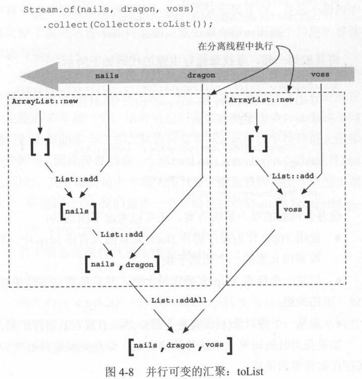
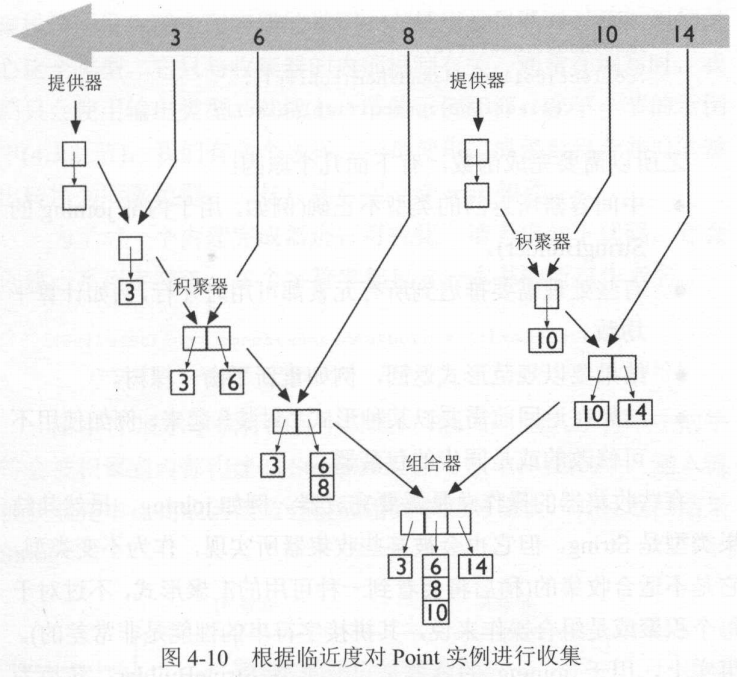

# 精通lambda表达式： Java多核编程
 

### 第一章 走进新生代的Java 

##### 1.1 从外部迭代到内部迭代  

- 1.1.1 内部迭代 
- 1.1.2 命令模式  
- 1.1.3 lambda表达式 

##### 1.2 从集合到流 

##### 1.3 从串行到并行  

##### 1.4 组合行为  

##### 1.5 小结  

### 第二章 Java lambda表达式的基础知识

##### 2.1 lambda表达式的定义

##### 2.2 lambda与匿名内部类  

lambda表达式有时被错误地认为是匿名内部类的语法糖，二者的差异： 
- 内部类创建表达式会确保创建一个拥有唯一标识的新对象， 而lambda表达式的结果可能有，也可能没有唯一标识，这取决于具体实现。 
- 内部类的声明会创建出一个新的命名作用域， 在这个作用域中， this和super指的是内部类本身的当前实例；lambda表达式并不会引入任何新的命名环境。 
  这就避免了内部类名称查找的复杂性。 

- 2.2.1 无标识性问题 
- 2.2.2 lambda的作用域规则 

##### 2.3 变量捕获 

##### 2.4 函数式接口 

##### 2.5 使用lambda表达式

##### 2.6 方法与构造器引用  

##### 2.7 类型检查 

- 2.7.1 何为函数类型  
- 2.7.2 匹配函数类型  

##### 2.8 重载解析  

- 2.8.1 lambda表达式的重载 
- 2.8.2 方法引用的重载 

##### 2.9 小结   

## 第三章 流与管道介绍 

引入lambda的两个动机： 更好的代码、更轻松的并行性  
高效使用流： 流编程模型   
lambda表达式： 促成了更细粒度的设计、组合型更强的操作   

##### 3.1 流基础  

流背后的中心思想是延迟计算： 直到需要时才计算值。 

延迟计算的一个重要优势可以通过Stream的“搜索”方法一探究竟：findFirst, findAny, anyMatch, allMatch与NoneMatch,这些都是短路操作。 

- 3.1.1 面向并行的代码
- 3.1.2 原生流  

##### 3.2 剖析管道  

流的真正威力是通过创建并组合起来的管道得以实现的。 
管道的各个阶段： 源自流的源， 随后通过中间操作进行一系列的转换 ， 最后在终止操作中停止。 

- 3.2.1 开始管道 
  Collection的流方法及流接口中的工厂方法  
  - java.util.Collection<T>： Stream<T> stream(), Stream<T> parallelStream(); 
  - java.util.stream.Stream<T>: Stream<T> empty(), Stream<T> of(T), Stream<T> of(T...); 
- 3.2.2 转换管道
- 3.2.3 非侵入性 
- 3.2.4 终止管道 
  - 搜索操作， 用于检测满足某种约束条件的流元素， 因此有时在没有处理完整个流时就会结束 
  - 汇聚，返回单个值，作为流元素值得一个总结，如reduce, count,max,min, collect
  - 副作用操作，forEach, forEachOrdered 

  Optional类操作说明
  - get: 返回一个值，如果没有值，抛出NoSuchElementException 
  - ifPresent: 如果值存在，提供给Consumer参数处理 
  - isPresent: 如果值存在，那么返回true, 否则返回false
  - orELse: 如果值存在， 那么返回，否则返回参数的值  
  - orElseGet: 如果值存在， 那么将其返回，否则调用supplier并返回其结果  

## 第四章  终止流：收集与汇聚 

##### 4.1 使用收集器  

- 4.1.1 独立的预定义收集器  
  - 积聚到框架提供的容器中  
  - 积聚到自定义的集合中  
  - 将元素积聚到分类Map中  
- 4.1.2 组合收集器  
- 4.1.3 连接管道  
- 4.1.4 示例说明：最流行的主题

##### 4.2 剖析收集器   

##### 4.3 编写收集器  

收集器由三部分组成： 提供器、积聚器、组合器  

- 通常情况下， 提供器用作容器的构造器，比如ArrayList::new 
- 积聚器的作用，是将元素添加到容器中，比如ArrayList::add
- 合并器是将两个部分的解决方案合并到一起，比如ArrayList::addAll 

- 4.3.1 完成器  
  需要完成器的原因  
  - 中间容器所有返回的类型不正确  
  - 有些处理需要推迟到所有元素都可用时才行
  - 结果要以规范的形式返回  
  - 结果在返回前以某种形式“封装”起来
- 4.3.2 示例说明：找到我的书 
- 4.3.3 收集器的规则  
- 